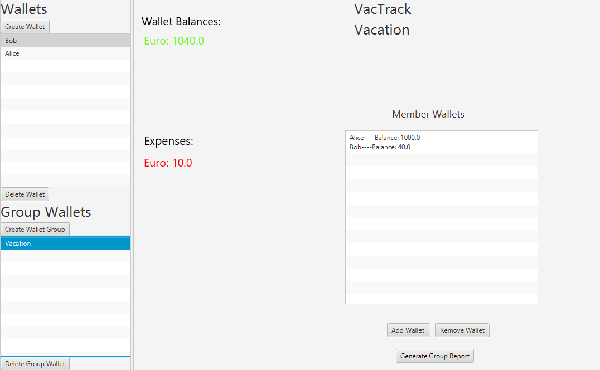

# Vacation Expense Tracker

This is a JavaFX project for an Expense Tracker designed specifically for tracking expenses during vacations. The application provides a user-friendly interface to manage and monitor expenses incurred during your trips. With the Vacation Expense Tracker, you can easily keep track of your spending and ensure that you stay within your budget.

## Features

- **Expense Logging**: Easily log your expenses by entering the amount spent, category, date, and any additional notes.
- **Daily Limits**: You can set a daily limit and see your remaining from the limit
- **Expense Visualization**: View your expenses in a visually appealing and informative way through charts and graphs.
- **Budget Management**: Set a budget for your vacation and track your expenses against it to ensure you stay on track.
- **Currency Conversion**: Convert expenses from one currency to another using real-time exchange rates.
- **Group Wallets**: You can add your single wallets to a group wallet to get a better oversight.
## Mockups
**Wallet Dashboard**

**Group Wallet Dashboard**

